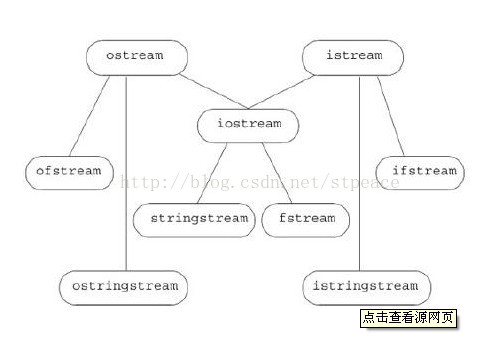

# IO

基本IO类的继承结构




IO类分为三类

1. iostream类： 负责与控制台输入输出打交道,istream,ostream,iostream
2. fstream类：  负责与文件输入输出打交道,ifstream和ofstream
3. stringstream类：负责与string上的输入输出打交道,istringstream和ostringstream

## 1. iostream

cin，cout，cerr是最基本的输入输出流 ,通过运算符"<<"和 “>>”操作

```cpp
string s1,s2;
cin>>s1>>s2;
cout<<s1+' '+s2;
if(!cin)
	cerr<<"input error";
```

cin的操纵流的条件状态：

> badbit      代表流已经崩溃
>
> failbit      表示一个IO操作失败
>
> eofbif      表示流到达文件结束
>
> goodbit    值为0, 表示没有错误

> istream s:
>
> **s.bad()**        对应badbit，如果badbit置位，返回true；
>
> **s.eof()**        对应eofbit状态，如上;
>
> **s.fai()**         对应failbit，如上;
>
> **s.good()**      对应goodbit,如上;
>
> **s.clear()**       复位所有错误状态，如果加上参数如s.clear(failbit)则仅复位failbit;
>
> **s.setstate(flag)** 将流s的状态复位为给定状态；
>
> **s.rdstate()**     返回当前s流的状态,返回值为 flag;

输出缓冲区设置：

```cpp
cout<<"hi"<<endl;  //输出字符串加上换行,然后刷新;
cout<<"hi"<<flush; //输出字符串,然后刷新;
cout<<"hi"<<ends;  //输出字符串加上一个空字符,然后刷新;
cout<<unitbuf //所有输出操作后都会立即刷新;
cout<<nounitbuf //取消上述操作
```

**关联输入和输出流**

```cpp
//默认情况下 cin和cerr 都关联到cout,因此读cin或写cerr 都会刷新cout;
x.tie(&O)             //将x关联到输出流O;
x.tie()                 //返回x当前关联的输出流指针,若没有关联到输出流则返回空指针;
```

**其他操作**

```cpp
cout.put(char ch)                                             //将字符ch加入输出流
cin.putback(char ch)                                      //将字符ch加入输入流；
cin.get(char *s,streamsize num,char delim)//从cin流读入字符串，从字符串的首指针，长度为num，或读到 delim结束，第三个参数可不带
getline(cin,string s,char delim)          //从cin流读入一行，放入字符串中，遇到行结束或读到delim结束，默认delim=‘\n’
cin.ignore( streamsize num=1, int delim ); //从cin流读入数，长度为num，或读到delim结束，默认为换行；
cin.gcount() //在使用get后可以使用 cin.gcount( )返回 已经读入的字符数
```


## 2. fstream

```cpp
#include <iostream>
#include <string>
#include <fstream>
using namespace std;
 
int main()
{
	ifstream in("test.txt"); // 建立in与文件test.txt之间的额关联
	if(!in)
	{
		cout << "error" << endl;
		return 1;
	}
 
	string line;
	while(getline(in, line))
	{
		cout << line << endl;	
	}
	return 0;
}
fstream infile("test.txt", ios::in);
fstream outfile("test.bak.txt", ios::out);
outfile<<infile.rdbuf();  //将infile流中的数据传入outfile流中
infile.close();
outfile.close();
```

> read.rdbuf()  获取文件读入流
>
> read.is_open()//返回bool值，指出与s绑定的文件是否已近打开；
>
> 对输入流操作：seekg（）与tellg（）
>
> 对输出流操作：seekp（）与tellp（）
>
> seekg（）是对输入文件定位，它有两个参数：
>
> 第一个参数是偏移量，可以是正负数值，正的表示向后偏移，负的表示
>
> 向前偏移
>
> 第二个参数是基地址,
>
> ios：：beg：表示输入流的开始位置
>
> ios：：cur：表示输入流的当前位置
>
> ios：：end：表示输入流的结束位置
>
> tellg() 函数不需要带参数，它返回当前定位指针的位置，也代表着输入流的大小
>
> peek()  //peek函数用于读取并返回下一个字符，但并不提取该字符到输入流中，也就是说，依然让该字符作为将要提取到输入流的下一个字符。
>
> **cin.read(char\* buffer, streamsize num ) //按字节读入**
>
> **cin.write(const char\* buffer, streamsize num )//按字节输出**


## 3. stringstream

C++引入了ostringstream、istringstream、stringstream这三个类，要使用他们创建对象就必须包含sstream.h头文件

istringstream类用于执行C++风格的串流的输入操作。 
ostringstream类用于执行C++风格的串流的输出操作。 
strstream类同时可以支持C++风格的串流的输入输出操作。

### istringstream

istringstream是由一个string对象构造而来，istringstream类从一个string对象读取字符

istringstream::istringstream(string str);

```cpp
#include <iostream>  
#include <sstream>  
using namespace std;  
int main()  
{  
    istringstream istr;  
    istr.str("1 56.7");  
    //上述两个过程可以简单写成 istringstream istr("1 56.7");  
    cout << istr.str() << endl;  
    int a;  
    float b;  
    istr >> a;  
    cout << a << endl;  
    istr >> b;  
    cout << b << endl;  
    return 0;  
}  
```

### ostringstream

ostringstream同样是由一个string对象构造而来，ostringstream类向一个string插入字符

ostringstream::ostringstream(string str);

```cpp
#include <sstream>
#include<iostream>
using namespace std;
int main()
{
	ostringstream ostr;
	//ostr.str("abc");//如果构造的时候设置了字符串参数,那么增长操作的时候不会从结尾开始增加,而是修改原有数据,超出的部分增长 
	ostr.put('d');
	ostr.put('e');
	ostr << "fg";
	string gstr = ostr.str();
	cout << gstr;
	cin.get();
    return 0;
}
```

### stringstream

stringstream是用于C++风格的字符串的输入输出的

stringstream::stringstream(string str);

通过str()函数获取stringtream中的字符串

```cpp
#include <sstream>
#include<iostream>
using namespace std;

int main()
{
	stringstream ostr("ccc");
	ostr.put('d');
	ostr.put('e');
	ostr << "fg";
	string gstr = ostr.str();
	cout << gstr << endl;

	char a;
	ostr >> a;
	cout << a << endl;
	string b;
	ostr >> b;
	cout << b<<endl;
	cin.get();
    return 0;
}
```

除此而外，stringstream类的对象我们还常用它进行string与各种内置类型数据之间的转换

```cpp
//--------int转string----------- 
int a=100; 
string str; 
sstr<<a; 
sstr>>str; 
cout<<str<<endl; 
//--------string转char[]-------- 
sstr.clear();//如果你想通过使用同一stringstream对象实现多种类型的转换，请注意在每一次转换之后都必须调用clear()成员函数。 
string name = "colinguan"; 
char cname[200]; 
sstr<<name; 
sstr>>cname; 
cout<<cname; 
```

### iomanip

iomanip是I/O流控制头文件,就像C里面的格式化输出一样

**涉及到格式化输出，不仅仅使用头文件，也将包含**

> cout.fill(char ch)             // 将填充字符设置为 ch
> cout.fill()                   //返回当前填充字符
> cout.width(int k)            //将输出宽度设置为k，设置仅对下次输出有效
> **cout.flags()**     //返回int值，表示当前格式
> **cout.precision(int k)** //保留k位有效数字,不加参数返回int值,表示当前设置
> **cout.setf(ios::  )** //开启格式 flag,setf可接受一个或两个参数，一个参数的版本为设置指定的格式，两个参数的版本中，后一个参数指定了删除的格式

```cpp
cout << 32 << endl;
cout.width (5);
cout << 32 << endl;
cout << 32 << endl;
cout.fill ('#');
cout.width (5);
cout << 32 << endl;
cout << cout.fill() << endl;
cout.setf(ios::right | ios::hex); //设置16进制右对齐
cout.setf(ios::right, ios::adjustfield); //取消其它对齐，设置为右对齐
```

**ios格式**

```text
boolalpha          //按bool值输出"true" 或 "false".
dec                     //以10进制输出.
hex                    //以16进制表示整数.
oct                   //以8进制表示整数
fixed                  //将符点数按照普通定点格式处理（非科学计数法）
internal            //在符号位和数值的中间插入需要数量的填充字符以使串两端对齐
left                   //在串的末尾插入填充字符以使串居左对齐
right                //在串的前面插入填充字符以使串居右对齐
scientific        // 将符点数按照科学计数法处理（带指数域）
showbase      //为整数添加一个表示其进制的前缀
showpoint     //在浮点数表示的小数中强制插入小数点（默认情况是浮点数表示的整数不显示小数点）
showpos        //强制在正数前添加+号
skipws            //忽略前导的空格
unitbuf           //前面已近介绍过,在插入（每次输出）操作后清空缓存
uppercase     //强制大写字母
ios::adjustfield  对齐格式的组合位
ios::basefield  进制的组合位
ios::floatfield  浮点表示方式的组合位
```

```cpp
int number = 32;
cout.setf (ios::showbase); //设置为显示进制前缀
//setw()函数在<iomanip>中,包括直接使用<<hex
cout << setw (6) << hex << 32 << setw (6) << oct << 32 << endl; 
cout << number << endl;//此时输出按照最近一次输出的格式输出
auto p = cout.flags();//用p记录当期的格式 cout.unsetf(ios::oct);//取消8进制输出
cout << number << endl;
cout.flags (p); //设置为格式p
cout << number << endl;
return 0;
```

### stringsteam清空方法

stringstream不能用clear()方法清空，清空方法为

```cpp
stringstream ss;
ss <<"fajflkdjf";
ss.str("");
```


## 4 将char * 转换为istream

```c++
struct membuf :std::streambuf {
	membuf(char* begin, char* end) {
		this->setg(begin, begin, end);
	}
};

int main()
{
	char buffer[] = "I'm a buffer with embedded nulls \0 and line\n feeds";
	membuf sbuf(buffer, buffer + sizeof(buffer));
	std::istream in(&sbuf);
	string line;
	while (getline(in, line)) {
		cout << "line:" << line << "\n";
	}
	system("Pause");
	return 0;
}
```

```cpp
std::istringstream ss(std::string(buf,len));
//或
std::istringstream ss;
ss.rdbuf()->pubsetbuf(buf,len);
```

## 5. stringstream转换为vector

```cpp
string line = "hello hello";
stringstream ss(line);
std::vector<char> mvec((istreambuf_iterator<char>(ss)),std::istreambuf_iterator<char>());
cout << mvec.size() << endl;
```

