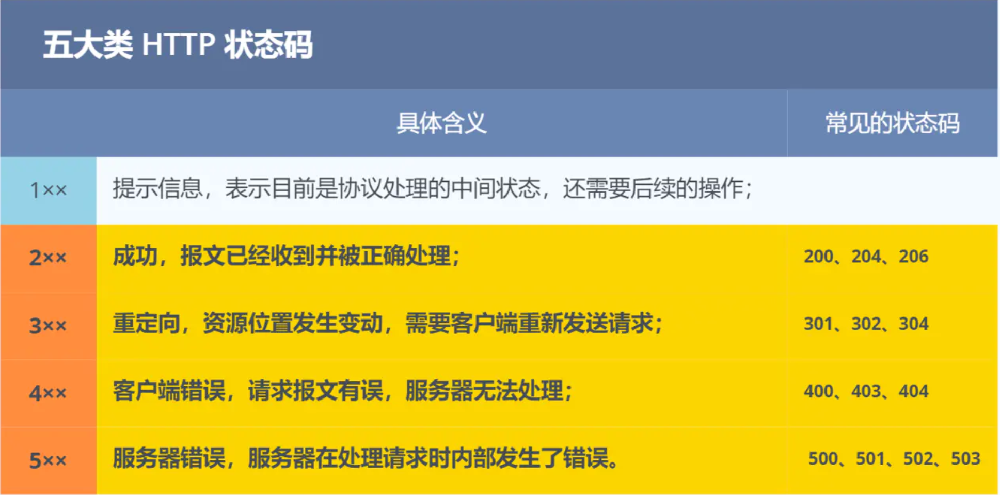

# Linux网络编程笔记

应用层，传输层（TCP、UDP），网络层（IP），数据链路层，物理层

## HTTP

HTTP 是超文本传输协议HyperText Transfer Protocol。是一个在计算机世界里专门在两点之间传输文字、图片、音频、视频等超文本数据的约定和规范。

超文本：包括文字，图片，视频，压缩包等。HTML就是常见的超文本，它本身只是纯文本文件，但内部用很多标签定义了图片，视频等的链接，再经过浏览器的解释，呈现给我们的就是一个有文字和画面的网页了。



| 状态码                    | 说明                                                         |
| ------------------------- | ------------------------------------------------------------ |
| 200 OK                    | 表示一切正常，如果是非HEAD请求，服务器返回的响应头有body信息 |
| 204 No Content            | 与200基本相同，但响应头没有body信息                          |
| 206 Partial Content       | 应用于HTTP分块下载或断点续传，表示响应返回的body数据不是资源的全部，而是其中的一部分，也是服务器处理成功的状态 |
| 301 Moved Permanently     | 表示永久重定向，说明请求的资源已经不存在了，需要用新的URL再次访问。新URL在返回头的Location字段 |
| 302 Found                 | 表示临时重定向，说明请求的资源还在，但暂时需要用另一个URL来访问。新URL在返回头的Location字段 |
| 304 Not Modified          | 不具有跳转的含义，表示资源未修改，重定向已存在的缓冲文件，也称缓存重定向，用于缓存控制。 |
| 400 Bad Request           | 表示客户端请求的报文有错                                     |
| 403 Forbidden             | 表示服务器禁止访问资源，并不是客户端的请求出错               |
| 404 Not Found             | 表示请求的资源在服务器不存在或未找到，所以无法提供给客户端   |
| 500 Internal Server Error | 服务器内部处理时错误                                         |
| 501 Not Implemented       | 客户端请求的功能还不支持                                     |
| 502 Bad Gateway           | 通常是服务器作为网关或代理时返回的错误码，表示服务器自身工作正常，访问后端服务器发生了错误。 |
| 503 Service Unavailable   | 表示服务器当前很忙，暂时无法响应请求。类似服务正忙，请稍后再试 |

### http常见字段

| 字段             | 说明                                                       |
| ---------------- | ---------------------------------------------------------- |
| host             | 服务器ip或域名                                             |
| Content-Length   | 表明本次发送数据的长度                                     |
| Content-Type     | 数据传输的格式。application/json；text/html; charset=utf-8 |
| Content-Encoding | 数据压缩的方法。gzip, deflate                              |
| Connection       | Close;Keep-Alive。立马关闭还是保持连接以便其他请求复用     |

### http特性

1. 优点：简单，灵活，易于扩展，应用广泛和跨平台

   * 简单

   HTTP基本报文格式是header+body，头部信息也是key-value简单文本的形式，易于理解

   * 灵活和易于扩展

   HTTP协议里的各类请求，URI/URL、状态码、头字段等每个组成要求都没有被固定死，允许开发人员自定义和扩充

2. 缺点：无状态，明文传输，不安全

   * 无状态

   无状态的好处是服务器不需要消耗资源来记录HTTP状态；坏处是在完成关联性操作时会非常麻烦（如登录，购物，下单，结算等），通常使用cookie解决

   * 明文传输

   明文传输，通过浏览器的F12控制台或Wireshark抓包可以直接查看，方便调试，但信息容易被窃取。

   * 不安全

   通行使用明文，内容可能会被窃听，比如，账号信息容易泄漏

   不验证通行方身份，可能遭遇伪装，如果假的淘宝等

   无法证明报文完整性，有可能已遭篡改，比如网页上植入垃圾广告

HTTPS在HTTP与TCP层之间加入了SSL/TLS协议，用来解决http安全性问题

### http报文

https://www.cnblogs.com/biyeymyhjob/archive/2012/07/28/2612910.html


## 套接字（socket）

套接字是用来连接网络的工具；就好比电话是人与人之间沟通的工具。

套接字分为TCP套接字和UDP套接字。

## TCP套接字

1. 服务端

   ```cpp
   //1. 创建套接字
   int socket(int domain,int type, int protocol);
   //2. 给创建好的套接字分配地址信息（IP地址和端口号）
   int bind(int sockfd,struct sockaddr *myaddr,socklen_t addrlen);
   //3. 把套接字转化为可接收状态
   int listen(int sockfd,int backlog);
   //4. 处理连接
   int accept(int sockfd,struct *addr,socklen_t addrlen);
   //5. 断开连接
   int shutdown(int sockfd,int howto);
   ```

2. 客户端

   ```cpp
   // 1. 创建套接字
   int socket(int domain,int type, int protocol);
   // 2. 向服务器端发送连接请求
   int connect(int sockfd,struct sockaddr *serv_addr,socklen_t addrlen);
   ```


### 函数说明

```cpp
int socket(int domain,int type, int protocol);
// domain 套接字中的协议族信息
	// AF_INET		IPv4互联网协议族
	// AF_INET6		IPv6互联网协议族
	// AF_LOCAL		本地通信的UNIX协议族
	// AF_PACKET	底层套接字的协议族
	// AF_IPX		IPX Novell协议族
// type 套接字数据传输类型
	// SOCK_STREAM	面向连接的套接字  TCP
	// SOCK_DGRAM	面向消息的套接字  UDP
// protocol 计算机间通信中使用的协议信息
	//大部分情况下可以向该参数传递0；除非在同一协议族中存在多个数据传输方式相同的协议

int ss = socket(AF_INET, SOCK_STREAM, 0);  //TCP套接字，同int ss = socket(AF_INET, SOCK_STREAM, IPPROTO_TCP);
int ss = socket(AF_INET, SOCK_DGRAM, 0);  //TCP套接字，同int ss = socket(AF_INET, SOCK_DGRAM, IPPROTO_UDP);
```

### 大小端转换

网络字节序为大端字节序，Intel主机为小端字节序，**大小端转换**函数如下：

```cpp
unsigned short htons(unsigned short); // host to network short,用于端口转换
unsigned short ntohs(unsigned short); // network to host short，用于端口转换
unsigned long htonl(unsigned long);  // host to network long，用于IP地址转换
unsigned long ntohl(unsigned long);  // network to host long，用于IP地址转换
```

除了向sockaddr_in结构体变量填充数据外，其他情况（数据发送和接收）无需考虑字节序问题。

### 字符串和IP地址转换

```cpp
//将字符串类型的IP(201.211.214.36)转换为32位大端序整数型值，失败返回INADDR_NONE
//可以检测无效的IP地址
in_addr_t inet_addr(const char *ip);
//和inet_addr功能相同，只不过该函数利用了in_addr结构体
int inet_aton(const char *ip,struct in_addr *addr);
//将网络字节序IP地址转换成我们熟悉的字符串形式；失败时返回-1
//注意：返回是char指针，在下次调用该函数时会被覆盖，若要长期保存，则应将字符串复制到其他内存空间
char *inet_ntoa(struct in_addr addr);
```


网络地址信息初始化方法

```cpp
char * ip = "211.217.168.13";
int PORT = 9190;
struct sockaddr_in servaddr;
bzero(&servaddr, sizeof(servaddr));
servaddr.sin_family = AF_INET;
servaddr.sin_addr.s_addr = htonl(ip);
servaddr.sin_port = htons(PORT);
```

**INADDR_ANY**:服务端使用，用来自动获取运行服务器端的计算机IP地址


```cpp
int bind(int sockfd,struct sockaddr *myaddr,socklen_t addrlen);
// sockfd 要分配地址信息（IP和端口）的套接字文件描述符
// myaddr 存有地址信息的结构体变量地址
// addrlen 第二个结构体变量的长度
// 失败返回-1
```

```cpp
// 等待连接请求
int listen(int sockfd,int backlog);
// sockfd 套接字文件描述符
// backlog  连接请求队列的长度，若为，则队列长度为5，表示最多使5个连接请求进入队列
```

```cpp
// 受理客户端连接请求
// accept会创建一个新的socket和客户端的socket进行通行；服务器端的socket主要是负责管理请求队列。
int accept(int sockfd,struct sockaddr *addr,socklen_t *addrlen);
// sockfd 服务器套接字文件描述符
// addr 保存发起连接请求的客户端地址信息的变量地址值，调用函数后向传递来的地址变量参数填充客户端地址信息
// addrlen 第二个参数addr结构体的长度
// 返回自动创建的用于数据IO的套接字的文件描述符；若等待队列为空，则accept不会返回，直到队列中出现新的客户端连接
```

```cpp
// 客户端向服务器端请求连接
// 在调用connect时，内核为客户端套接字添加IP和端口号（端口号是随机分配的），不需要手动调用bind去绑定
int connect(int sockfd,struct sockaddr *servaddr,socklen_t addrlen);
// sockfd 客户端套接字文件描述符
// servaddr  保存目标服务器端地址信息的变量地址值
// addrlen servaddr的长度
// 连接成功返回0，连接失败返回-1。（只要连接进入到服务端的等待队列中即算成功）
```

```cpp
// 断开连接
int shutdown(int sockfd,int howto);
// 成功时返回0，失败时返回-1
// sockfd 需要断开的套接字文件描述符
// howto 传递断开方式信息
//    SHUT_RD:断开输入流，清除输入缓冲区数据，同时无法调用输入相关函数
//    SHUT_WR:断开输出流，输出缓冲区若有数据，将数据传输至目标主机
//    SHUT_RDWR:同时断开IO流
```


TCP套接字缓冲区特性：

1. IO缓冲在每个TCP套接字中单独存在
2. IO缓冲在创建套接字时自动生成
3. 即使关闭套接字也会继续传递输出缓冲中遗留的数据
4. 关闭套接字将丢失输入缓冲中的数据

### TCP半关闭文件传输服务

```cpp
// file_server.c
#include<stdio.h>
#include<stdlib.h>
#include<string.h>
#include<unistd.h>
#include<arpa/inet.h>
#include<sys/socket.h>

#define BUF_SIZE 30

void error_handling(char *buff);

int main(int argc,char *argv[])
{
    int serv_sd,clnt_sd;
    FILE *fp;
    int read_cnt;
    char buf[BUF_SIZE];

    struct sockaddr_in serv_adr,clnt_adr;
    socklen_t clnt_adr_sz;

    if(argc<2){
        printf("Usage:%s <port>\n",argv[0]);
        exit(1);
    }

    fp = fopen("file_server.c","rb");


    serv_sd = socket(PF_INET,SOCK_STREAM,0);
    memset(&serv_adr,0,sizeof(serv_adr));
    serv_adr.sin_family = AF_INET;
    serv_adr.sin_addr.s_addr = htonl(INADDR_ANY);
    serv_adr.sin_port = htons(atoi(argv[1]));

    if(bind(serv_sd,(struct sockaddr*)&serv_adr,sizeof(serv_adr))==-1)
        error_handling("bind() error");
    if(listen(serv_sd,5)==-1)
        error_handling("listen() error");
    
    clnt_adr_sz = sizeof(clnt_adr);
    clnt_sd = accept(serv_sd,(struct sockaddr*)&clnt_adr,&clnt_adr_sz);

    while(1){
        read_cnt = fread((void *)buf,1,BUF_SIZE,fp);
        if(read_cnt<BUF_SIZE){
            write(clnt_sd,buf,read_cnt);
            printf("send file complte\n");
            break;
        }
        write(clnt_sd,buf,BUF_SIZE);
    }
    shutdown(clnt_sd,SHUT_WR);
    memset(buf,0,BUF_SIZE);
    read_cnt = read(clnt_sd,buf,BUF_SIZE);
    printf("Message from client:%s \n",buf);
    fclose(fp);
    close(serv_sd);
    close(clnt_sd);
    return 0;
}

void error_handling(char *buf){
    fputs(buf,stderr);
    fputs("\n",stderr);
    exit(1);
}
```

```cpp
// file_client.c
#include <netinet/in.h>
#include<stdio.h>
#include<stdlib.h>
#include<string.h>
#include<unistd.h>
#include<arpa/inet.h>
#include<sys/socket.h>

#define BUF_SIZE 30

void error_handling(char *buff);

int main(int argc,char *argv[])
{
    int sd;
    FILE *fp;

    char buf[BUF_SIZE];
    int read_cnt;
    struct sockaddr_in serv_adr;
    if(argc!=3){
        printf("Usage:%s <IP> <port>",argv[0]);
        exit(1);
    }
    fp = fopen("receive.dat","wb");
    sd = socket(PF_INET,SOCK_STREAM,0);
    memset(&serv_adr,0,sizeof(serv_adr));
    serv_adr.sin_family = AF_INET;
    serv_adr.sin_addr.s_addr = inet_addr(argv[1]);
    serv_adr.sin_port = htons(atoi(argv[2]));

    connect(sd,(struct sockaddr*)&serv_adr,sizeof(serv_adr));
    while((read_cnt=read(sd,buf,BUF_SIZE))!=0){
        fwrite((void *)buf,1,read_cnt,fp);
    }
    puts("Received file data");
    write(sd,"Thanks you",10);
    fclose(fp);
    close(sd);
    return 0;
}

void error_handling(char *buf){
    fputs(buf,stderr);
    fputs("\n",stderr);
    exit(1);
}
```

```shell
gcc file_server.c -o file_server
./file_server 9190

gcc file_client.c -o file_client
./file_client 127.0.0.1 10086
```


## UDP套接字

UDP不同于TCP，不存在请求连接和受理过程，因此在某种意义上无法明确区分服务器端和客户端。只是因其提供服务而称为服务器端。

```cpp
ssize_t sendto(int sockfd,void *buff,size_t nbytes,int flags,struct sockaddr *to,socklen_t addrlen);
// sockfd  用于传输数据的UDP套接字文件描述符
// buff  保存待传输数据的缓冲地址值
// nbytes  待传输的数据长度，以字节为单位
// flags  可选参数，没有则传递0
// to    存有目标地址信息的sockaddr结构体变量的地址值
// addrlen  传递给参数to的地址值结构体变量长度

//可以调用bind函数给UDP分配地址和端口
// 首次调用sendto函数时，如果尚未分配地址和端口，给相应套接字自动分配IP和端口，而且分配的地址一直保留到程序结束为止。
```


```cpp
ssize_t recvfrom(int sockfd,void *buff,size_t nbytes,int flags,struct sockaddr *from,socklen_t addrlen);
// sockfd  用于接收数据的UDP套接字文件描述符
// buff  保存接收数据的缓冲地址值
// nbytes  可接收的最大字节数
// flags  可选参数，没有则传递0
// to    存有发送端地址信息的sockaddr结构体变量的地址值
// addrlen  传递给参数from的地址值结构体变量长度
```

### connect UDP

UDP默认是unconnect的，即每次数据传输分为以下3个阶段：

1. 向UDP套接字注册目标IP和端口号
2. 传输数据
3. 删除UDP套接字中注册的目标地址信息

但是在UDP向同一目标主机发送多个数据时，以上1和3阶段不太合理，会降低UDP的性能，所以需要使用connect UDP来提高性能

```cpp
ssize_t connect(sockfd,struct sockaddr *to,socklen_t addrlen);
```

UDP套接字调用connect函数并不意味着要与对方UDP套接字连接，这只是向UDP套接字注册目标IP和端口信息。

调用connect指定了收发对象后，不仅可以使用sendto、recevfrom，还可以使用write、read函数进行通信。

## 域名

```cpp
//通过传递字符串格式的域名获取IP地址
struct hostent * gethostbyname(const char *hostname);
// 成功时返回hostent结构体地址，失败时返回NULL指针
struct hostent{
    char * h_name;  //official name，官方域名
    char ** h_aliases; //alias list,通过多个域名访问同一主页
    int h_addrtype;  //host address type，IP地址的地址族信息，IPv6/IPv4
    int h_length;  //address length,IP地址长度，IPv4为4，IPv6为16
    char ** h_addr_list;  //in_addr list，IP地址信息，可能有多个用于负载均衡
}
```

```cpp
//利用IP获取域名
struct hostent * gethostbyaddr(const char* addr,socklen_t len,int family);
// addr 含有IP地址信息的in_addr结构体指针
// len 向第一个参数传递的地址信息的字节数，IPv4为4，IPv6为16
// family 传递地址族信息，AF_INET,AF_INET6
```

## IO函数

```cpp
#include<sys/socket.h>
// sockfd 套接字文件描述符
// buf  待传输数据缓冲区地址
// nbytes 待传输的字节数
// flags 传输数据时指定的可选项信息
ssize_t send(int sockfd,const void *buf,size_t nbytes,int flags);
ssize_t recv(int sockfd,const void *buf,size_t nbytes,int flags);
```

| flags选项     | 含义                                               | send | recv |
| ------------- | -------------------------------------------------- | ---- | ---- |
| MSG_OOB       | 用于传输带外数据（out of band data）               | Y    | Y    |
| MES_PEEK      | 验证输入缓冲区是否存在接受的数据                   | N    | Y    |
| MSG_DONTROUTE | 数据传输过程中不参考路由表，在本地网络中寻找目的地 | Y    | N    |
| MSG_DONTWAIT  | 调用IO函数时不阻塞，用于使用非阻塞IO               | Y    | Y    |
| MES_WAITALL   | 防止函数返回，直到接受全部请求的字节数             | N    | Y    |

```cpp
#include<sys/uio.h>
// 将分散保存在多个缓冲区的数据一并发送，有助于提高数据通信效率
// 成功时返回发送的字节数，失败是返回-1
// filedes 数据传输对象的套接字文件描述符，但该函数并不只限于套接字，可以传递文件描述符或标准输出描述符
// iov  iovec结构体数组的地址值
// iovcnt  向第二个参数传递的数组长度
ssize_t writev(int filedes,const sturct iovec* iov,int iovcnt);
// 成功时返回接收的字节数，失败是返回-1
ssize_t readv(int filedes,const sturct iovec* iov,int iovcnt);

struct iovec{
    void *iov_base; //缓冲地址
    void iov_len; //缓冲大小
}
```


## IO复用

使用一个进程（线程）处理所有的连接请求（同一时间只能处理一个请求）

### select

select函数调用方法和顺序

1. 设置文件描述符、指定监视范围、设置超时
2. 调用select函数
3. 查看调用结果

```cpp
FD_ZERO(fd_set *fdset);          //将fd_set变量的所有位初始化为0
FD_SET(int fd,fd_set *fdset);    //在参数fdset指向的变量中注册文件描述符fd的信息
FD_CLR(int fd,fd_set *fdset);    //在参数fdset指向的变量中清除文件描述符fd的信息
FD_ISSET(int fd,fd_set *fdset);  //若参数fdset指向的变量中包含文件描述符fd的信息，则返回真
```


```cpp
#include<sys/select.h>
#include<sys/time.h>

// 发生错误时返回-1，超时时返回0。因发生关注事件返回时，返回大于0的值，该值是发生事件的文件描述符数。
// maxfd  监视对象文件描述符数量
// readset 将所有关注“是否存在待读取数据”的文件描述符注册到fd_set型变量，并传递其地址
// writeset 将所有关注“是否可传输无阻塞数据”的文件描述符注册到fd_set型变量，并传递其地址
// exceptset 将所有关注“是否发生异常”的文件描述符注册到fd_set型变量，并传递其地址
// timeout 调用select函数后，为防止陷入无线阻塞的状态，传递超时信息
int select(int maxfd,fd_set *readset,fd_set *writeset,fd_set *exceptset,const struct timeval *timeout);

struct timeval{
    long tv_sec;  // 秒
    long tv_usec; // 毫秒
}
```

**select函数调用完成后，向其传递的fd_set变量中将发生变化。原来为1的所有位均变为0，但发生变化的文件描述符对应的位除外。因此可以认为值仍为1的位置上文件描述符发生了变化。**

### select函数调用示例

```cpp
#include<stdio.h>
#include<unistd.h>
#include<sys/time.h>
#include<sys/select.h>

#define BUF_SIZE 30

int main(int argc,char *argv[]){
    fd_set reads,temps;
    int result,str_len;
    char buf[BUF_SIZE];
    struct timeval timeout;
    FD_ZERO(&reads);
    FD_SET(0,&reads);  //0为标准输入，监听标准输入

    while(1){
        temps = reads;  //每次调用select后fd_set会被重置，所以需要每次从初始值拷贝
        timeout.tv_sec = 5;  //每次调用select时，timeout会被替换为超时前剩余时间，所以每次需要重新设置timeout
        timeout.tv_usec = 0;
        // 调用select，超时返回0，控制台有输入返回大于0的整数
        result = select(1,&temps,0,0,&timeout); 
        if(result==-1){
            puts("select error!");
            break;
        }else if(result == 0){
            puts("timeout!");
        }else{
            if(FD_ISSET(0,&temps)){  //验证发生变化的文件描述符是否为标准输入
                str_len = read(0,buf,BUF_SIZE);
                buf[str_len]=0;
                printf("message from console:%s",buf);
            }
        }
    }
    return 0;
}
```

### select函数实现IO复用服务端

使用select函数实现IO复用并不常用，不记录代码，可回看 《TCP IP网络编程》12.2章节

### epoll

```cpp
struct epoll_event{
    __uint32_t events;
    epoll_data_t data;
}

typedef union epoll_data{
    void *ptr;
    int fd;
    __uint32_t u32;
    __uint64_t u64;
}epoll_data_t;
```


```cpp
#include<sys/epoll.h>
// 创建保存epoll文件描述符的空间
// 成功时返回epoll文件描述符，失败时返回-1
// 调用epoll_create函数时创建的文件描述符保存空间称为“epoll例程”
// size:向操作系统建议的例程大小
int epoll_create(int size);
// 向空间注册或注销文件描述符
// 成功时返回0，失败时返回-1
// epfd 用于注册件事对象的epoll例程的文件描述符
// op  用于指定监视对象的添加、删除或更改操作
// fd  需要注册监视对象的文件描述符 
// evnet 监视对象的事件类型
int epoll_ctl(int epfd,int op,int fd,struct epoll_event *event);
// 等待文件描述符发生变化
// 成功时返回发生事件的文件描述符数，失败时返回-1
// epfd 用于注册件事对象的epoll例程的文件描述符
// events 保存发生事件的文件描述符集合的结构体地址
// maxevents 第二个参数中可以保存的最大事件数
// timeout 以1/1000秒为单位的等待时间，传递-1时，一直等待直到事件发生
int epoll_wait(int epfd,struct epoll_event *events,int maxevents,int timeout);
```

### epoll回声服务

```cpp
//gcc test.c -o test
#include <netinet/in.h>
#include<stdio.h>
#include<stdlib.h>
#include<string.h>
#include<unistd.h>
#include<arpa/inet.h>
#include<sys/socket.h>
#include<sys/epoll.h>

#define BUF_SIZE 100
#define EPOLL_SIZE 50

void error_handling(char *buff);

int main(int argc,char *argv[])
{
    int serv_sock,clnt_sock;
    struct sockaddr_in serv_adr,clnt_adr;
    socklen_t adr_sz;
    int str_len,i;
    char buf[BUF_SIZE];

    struct epoll_event *ep_events;
    struct epoll_event event;
    int epfd,event_cnt;
    if(argc<2){
        printf("Usage:%s <port>\n",argv[0]);
        exit(1);
    }
    serv_sock = socket(PF_INET,SOCK_STREAM,0);
    memset(&serv_adr,0,sizeof(serv_adr));
    serv_adr.sin_family = AF_INET;
    serv_adr.sin_addr.s_addr = htonl(INADDR_ANY);
    serv_adr.sin_port = htons(atoi(argv[1]));

    if(bind(serv_sock,(struct sockaddr*)&serv_adr,sizeof(serv_adr))==-1)
        error_handling("bind() error");
    if(listen(serv_sock,5)==-1)
        error_handling("listen() error");
    
    epfd = epoll_create(EPOLL_SIZE);
    ep_events = malloc(sizeof(struct epoll_event)*EPOLL_SIZE);
    event.events = EPOLLIN;
    event.data.fd = serv_sock;
    epoll_ctl(epfd,EPOLL_CTL_ADD,serv_sock,&event);

    while(1){
        event_cnt = epoll_wait(epfd,ep_events,EPOLL_SIZE,-1);
        if(event_cnt==-1){
            puts("epoll_wait() error");
            break;
        }

        for(i=0;i<event_cnt;i++){
            if(ep_events[i].data.fd==serv_sock){
                adr_sz = sizeof(clnt_adr);
                clnt_sock = accept(serv_sock,(struct sockaddr*)&clnt_adr,&adr_sz);
                event.events = EPOLLIN;
                event.data.fd = clnt_sock;
                epoll_ctl(epfd,EPOLL_CTL_ADD,clnt_sock,&event);
                printf("connect client:%d \n",clnt_sock);
            }else{
                str_len = read(ep_events[i].data.fd,buf,BUF_SIZE);
                if(str_len==0){
                    epoll_ctl(epfd,EPOLL_CTL_DEL,ep_events[i].data.fd,NULL);
                    close(ep_events[i].data.fd);
                    printf("close client:%d \n",ep_events[i].data.fd);
                }else{
                    write(ep_events[i].data.fd,buf,str_len);
                }
            }
        }
    }
    close(serv_sock);
    close(epfd);
    return 0;
}

void error_handling(char *buf){
    fputs(buf,stderr);
    fputs("\n",stderr);
    exit(1);
}
```


### 条件触发和边缘触发

条件触发：只要输入缓冲区中有数据，就会一直通知该事件。

边缘触发：输入缓冲区收到数据时仅注册1次该事件。可以分离接收数据和处理数据的时间点；


## 文件描述符复制

```cpp
#include<unistd.h>
int dup(int fildes);
// dup2 明确指定复制文件描述符的整数值。向其传递大于0且小于进程能生成的最大文件描述符时，该值将成为复制出的文件描述符值
int dup2(int fildes,int fildes2);
```


## Reactor模式（非阻塞同步网络模式）

non-blocking IO + IO multiplexing模型，基本结构使一个事件循环，以事件驱动和时间回调的方式实现业务逻辑

**缺点**：基于事件驱动的编程模型要求事件回调函数必须是非阻塞的。对于涉及网络IO的请求响应式协议，它容易割裂业务逻辑，使其散布于多个回调函数中，相对不容易理解和维护

* lighttpd， 单线程服务器。（Nginx与之类似，每个工作进程有一个event loop）
* libevent， libev
* ACE，Poco C++ libraries
* java NIO，包括Apache Mina和Netty
* POE（Perl）
* Twisted（Python）

单Reactor单进程/线程   redis

多 Reactor 多线程 Netty Memcache  

多 Reactor 多进程  Nginx


## Proactor模式（**异步网络模式**）

* Boost.Asio
* Windows I/O Completion Ports
* AEC也实现了Proactor模式

**阻塞 I/O**，当用户程序执行 `read` ，线程会被阻塞，一直等到内核数据准备好，并把数据从[内核缓冲区](https://www.zhihu.com/search?q=内核缓冲区&search_source=Entity&hybrid_search_source=Entity&hybrid_search_extra={"sourceType"%3A"answer"%2C"sourceId"%3A1856426252})拷贝到应用程序的缓冲区中，当拷贝过程完成，`read` 才会返回。**阻塞等待的是「内核数据准备好」和「数据从内核态拷贝到用户态」这两个过程**

**非阻塞 I/O**，非阻塞的 read 请求在数据未准备好的情况下立即返回，可以继续往下执行，此时应用程序不断轮询内核，直到数据准备好，内核将数据拷贝到[应用程序缓冲区](https://www.zhihu.com/search?q=应用程序缓冲区&search_source=Entity&hybrid_search_source=Entity&hybrid_search_extra={"sourceType"%3A"answer"%2C"sourceId"%3A1856426252})，`read` 调用才可以获取到结果。

无论 read 和 send 是阻塞 I/O，还是非阻塞 I/O 都是同步调用。因为在 read 调用时，内核将数据从内核空间拷贝到用户空间的过程都是需要等待的，也就是说这个过程是同步的，如果内核实现的拷贝效率不高，read 调用就会在这个同步过程中等待比较长的时间

**异步 I/O** 是「内核数据准备好」和「数据从内核态拷贝到用户态」这**两个过程都不用等待**。当我们发起 `aio_read` （异步 I/O） 之后，就立即返回，内核自动将数据从内核空间拷贝到用户空间，这个拷贝过程同样是异步的，内核自动完成的，和前面的同步操作不一样，**应用程序并不需要主动发起拷贝动作**

可惜的是，在 Linux 下的异步 I/O 是不完善的， `aio` 系列函数是由 POSIX 定义的异步操作接口，不是真正的操作系统级别支持的，而是在用户空间模拟出来的异步，并且仅仅支持基于本地文件的 aio 异步操作，网络编程中的 socket 是不支持的，这也使得基于 Linux 的高性能网络程序都是使用 Reactor 方案


https://www.zhihu.com/question/26943938


## 同步vs异步

在同步编程中，所有操作都是顺序执行的。

异步编程是事件驱动的。你启动一个操作，但不知道它何时会借宿，你只提供一个回调，当操作结束是，它会回调这个API，并返回操作结果。异步网络通信通常比同步网络通信更加难以测试和调试。


## 多线程服务器的常用编程模型

### one (event) loop per thread 

程序里的每个IO线程有一个event loop（或者叫Reactor），用于处理读写和定时事件。

这种方式的好处是：

* 线程数目基本固定，可以在程序启动的时候设置，不会频繁创建和销毁
* 可以很方便的在线程间调配负载
* IO发生的线程是固定的，同一个TCP连接不用考虑事件并发

### one (event) loop per thread + 线程池


## 进程间通信只用TCP

1. 可以跨主机，具有伸缩性。如果一台机器处理能力不够，很方便的扩展到多台机器。
2. TCP port由一个进程独占，可以防止程序重复启动，且操作系统会自动回收。
3. 两个进程通过TCP通信，如果一个崩溃，操作系统会关闭连接，另一个进程几乎立刻就能感知，可以快速failover
4. TCP协议可记录，可重现
5. TCP可以跨语言，服务端和客户端不必使用同一种语言

## boost实现rest api

https://plape.medium.com/using-boost-and-served-libraries-to-build-a-c-rest-api-service-449aeebe6509

## C++ swagger

https://dzone.com/articles/c-restful-web-service-with-swagger-ui-and-auto-doc

https://github.com/oatpp/oatpp


## boost asio

io_service  和操作系统的输入/输出服务进行交互。

ip::tcp::accept  接收器，用来接收客户端链接的对象。

ip::tcp::endpoint  端点，用某个端口号连接到的一个地址