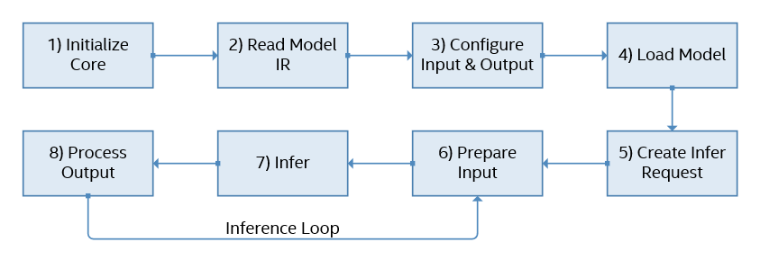

# openvino

## 安装

https://docs.openvinotoolkit.org/latest/openvino_docs_install_guides_installing_openvino_linux.html

https://docs.openvinotoolkit.org/latest/openvino_docs_install_guides_installing_openvino_docker_linux.html

下载linux版本openvino安装包：l_openvino_toolkit_p_2021.2.185.tgz

```shell
# 在docker中安装需要先安装cpio
sudo apt-get install cpio
# 安装openssl
sudo apt-get install openssl libssl-dev
# 安装cmake 3.13以上
sudo apt-get install cmake 
# 安装python3
sudo apt-get install python3 python3-pip
# 安装openvino
cd l_openvino_toolkit_p_2021.2.185
./install.sh
# 安装依赖(英特尔优化的OpenCV库构建,深度学习推理引擎,深度学习模型优化器工具的依赖)
cd /opt/intel/openvino_2021/install_dependencies
sudo -E ./install_openvino_dependencies.sh
# 设置环境变量
source /opt/intel/openvino_2021/bin/setupvars.sh
# 或者将环境变量设置加入到bashrc中
vi <user_directory>/.bashrc
# 加入source /opt/intel/openvino_2021/bin/setupvars.sh
```

```shell
# 配置模型优化器
cd /opt/intel/openvino_2021/deployment_tools/model_optimizer/install_prerequisites
./install_prerequisites_onnx.sh #配置onnx环境，支持{caffe|tf|tf2|mxnet|kaldi|onnx}
```

```cpp
//sample路径
/opt/intel/openvino_2021/deployment_tools/inference_engine/samples
```


## 支持的设备

CPU，intel集成显卡，intel算力棒，intel VPUs视觉加速器，Intel GNA(一种低功耗神经网络协处理器，可在进行连续边缘推理)

## 模型转换

在openvino的安装目录openvino\openvino_2021.3.394\deployment_tools\model_optimizer目录下，mo.py脚本进行模型转换；

在运行脚本之前需要根据deployment_tools\model_optimizer\install_prerequisites中的脚本安装相应环境

```shell
python mo.py -h
# 可选参数
-h, --help 显示帮助信息并退出。
--framework {tf,caffe,mxnet,kaldi,onnx}。用于训练输入模型的框架名称。
# 框架无关的参数
--input_model INPUT_MODEL, -w INPUT_MODEL, -m INPUT_MODEL。
		Tensorflow *：具有预训练模型的文件（冻结后的二进制或文本.pb文件）。 Caffe *：具有模型权重的模型原型文件
--model_name MODEL_NAME，-n MODEL_NAME
		将Model_name参数传递给最终的create_ir转换。 此参数用于在生成的IR中命名网络并输出.xml / .bin文件。
--output_dir OUTPUT_DIR，-o OUTPUT_DIR
		存储生成的IR的目录。 默认情况下，它是启动模型优化器的目录。
--input_shape INPUT_SHAPE
		应输入模型的输入节点的输入形状。 形状定义为用逗号分隔的用括号或方括号括起来的整数列表，例如[1,3,227,227]或（1,227,227,3），其中尺寸顺序取决于模型的框架输入布局。 例如，[N，C，H，W]用于Caffe *模型，[N，H，W，C]用于TensorFlow *模型。 模型优化器执行必要的转换，以将形状转换为推理引擎所需的布局（N，C，H，W）。 该形状不应包含未定义的尺寸（？或-1），并且应适合在图形的输入操作中定义的尺寸。 如果模型中有多个输入，则–input_shape应包含每个输入的形状定义，并用逗号分隔，例如：[1,3,227,227]，[2,4]对于具有两个具有4D和2D形状的输入的模型 。 或者，使用--input选项指定形状。
--scale SCALE, -s SCALE
		网络输入的所有输入值都将被该值除。 当输入列表被--input参数覆盖时，此比例将不适用于与模型原始输入不匹配的任何输入。
--reverse_input_channels
		将输入通道顺序从RGB切换到BGR（反之亦然）。 当且仅当通道数等于3时，才应用于模型的原始输入。在应用--mean_values和--scale_values选项后应用，因此--mean_values和--scale_values中的数字按 原始模型。
--log_level {CRITICAL,ERROR,WARN,WARNING,INFO,DEBUG,NOTSET}
--input INPUT
		用逗号分隔的输入节点名称（带形状，数据类型和冻结值）的带引号的列表。 形状和值指定为以空格分隔的列表。 输入节点的数据类型以大括号指定，并且可以具有以下值之一：f64（float64），f32（float32），f16（float16），i64（int64），i32（int32），u8（uint8），布尔值。 例如，“ 0：node_name1 [3 4]，node_name2：1 [2] {i32}-> [20 15]”,输入端口0的形状为[3 4]的节点`node_name1`，并冻结输入端口1为节点`node_name2`(类型为int32置为[20 15]形状为[2]) ：。
--output OUTPUT
		模型的输出操作的名称。 对于TensorFlow *，请勿在该名称上添加:0。
--mean_values MEAN_VALUES, -ms MEAN_VALUES
		用于输入图像每个通道的平均值。 以（R，G，B）或[R，G，B]格式提供的值。 可以为模型的所需输入定义，例如：“-mean_values data [255,255,255]，info [255,255,255]”。 通道的确切含义和顺序取决于原始模型的训练方式
--scale_values SCALE_VALUES
		用于输入图像每个通道的比例值。 值以（R，G，B）或[R，G，B]格式提供。 可以为模型的所需输入定义，例如：“-scale_values data [255,255,255]，info [255,255,255]”。 通道的确切含义和顺序取决于原始模型的训练方式。
--data_type {FP16,FP32,half,float}
		所有中间张量和权重的数据类型。 如果原始模型位于FP32中，并且指定了--data_type = FP16，则所有模型权重和偏差都将量化为FP16。
--disable_fusing
		关闭将线性运算与卷积的融合
--disable_resnet_optimization
		关闭Resnet优化
--finegrain_fusing FINEGRAIN_FUSING
		正则表达式用于不会融合的层/操作。 示例：--finegrain_fusing Convolution1，.* Scale.*
--disable_gfusing
		关闭分组卷积的融合
--enable_concat_optimization
		打开Concat优化。
--move_to_preprocess
		将平均值移至IR预处理部分
--extensions EXTENSIONS
		目录或带有扩展名的目录的逗号分隔列表。 要禁用所有扩展名，包括放置在默认位置的扩展名，请传递一个空字符串。
--batch BATCH, -b BATCH
		输入的batch
--version
		优化器的版本
--silent
		禁止ERROR级别以外的所有日志输出
--freeze_placeholder_with_value FREEZE_PLACEHOLDER_WITH_VALUE
		用具有提供的值的恒定节点替换输入层，如：“ node_name-> True”。在将来的版本中将不再使用。使用--input选项指定冻结值。
--generate_deprecated_IR_V7
		强制生成具有已弃用的IR V7的旧IR规范中的图层的。
--static_shape
		为固定的输入形状启用IR生成（将“ ShapeOf”操作和形状计算子图折叠为“ Constant”）。 对于此类IR，在运行时使用Inference Engine API更改模型输入形状可能会失败。
--keep_shape_ops
		该选项被忽略。 默认情况下启用可变shape
--disable_weights_compression
		禁用压缩并以原始精度存储权重。
--progress
		启用模型转换进度显示。
--stream_output
		将模型转换进度显示切换到多行模式。
--transformations_config TRANSFORMATIONS_CONFIG
		将配置文件与转换描述一起使用
		
# kaldi特有参数
--counts COUNTS
		counts文件路径
--remove_output_softmax
		删除作为输出层的SoftMax层
--remove_memory
		删除内存层并改用其他输入输出
```

转换示例：

```shell
python mo_onnx.py --input_model D:\project\python\pytorchl\mnist.onnx
# 在当前目录下输出mnist.xml和mnist.bin
python3 mo_onnx.py --input_model /root/xvector.onnx --input_shape [1,512,20]
```

## 基本概念

### Blobs

`InferenceEngine::Blob`是用于处理内存的主要类。使用此类，您可以读写内存，获取有关内存结构的信息等。

```cpp
//创建特定布局的blob
InferenceEngige :: TensorDesc tdesc（FP32，{1，3，227，227}，InferenceEngine :: Layout :: NCHW）;
InferenceEngine :: Blob :: Ptr blob = InferenceEngine :: make_shared_blob <float>（tdesc）;
//使用指定数据创建Blob
float *data = new float[1*3*227*227];
InferenceEngine :: Blob :: Ptr blob = InferenceEngine :: make_shared_blob <float>（tdesc,data）;
```

### Layouts

`InferenceEngine::TensorDesc` 是提供布局格式描述的特殊类，允许使用标准格式（ `InferenceEngine::Layout::NCDHW`, `InferenceEngine::Layout::NCHW`, `InferenceEngine::Layout::NC`, `InferenceEngine::Layout::C` 等）

创建一个复杂的布局，应该使用InferenceEngine :: BlockingDesc，它允许使用偏移量和步幅来定义内存块。

## 获取设备信息

https://docs.openvinotoolkit.org/latest/openvino_docs_IE_DG_InferenceEngine_QueryAPI.html

```cpp
//获取支持设备列表
InferenceEngine::Core core;
std::vector<std::string> availableDevices = core.GetAvailableDevices();
for(auto dev:availableDevices)
    cout<<dev<<endl;  //CPU,GNA
//获取设备名
std::string cpuDeviceName = core.GetMetric("CPU", METRIC_KEY(FULL_DEVICE_NAME)).as<std::string>();
cout<<cpuDeviceName<<endl;  //Intel(R) Core(TM) i7-8750H CPU @ 2.20GHz
```


## 推理过程

https://docs.openvinotoolkit.org/latest/openvino_docs_IE_DG_Integrate_with_customer_application_new_API.html



1. **创建推理引擎核心**以管理可用设备并读取网络对象：

   ```cpp
   InferenceEngine::Core core;
   InferenceEngine::CNNNetwork network;
   InferenceEngine::ExecutableNetwork executable_network;
   ```

   

2. **读取**由Model Optimizer创建**的模型IR**（支持.xml格式）**或从ONNX格式**（.onnx和.prototxt是受支持的格式）中**读取模型**

   ```cpp
   network = core.ReadNetwork("Model.xml");
   //或
   network = core.ReadNetwork("model.onnx");
   ```

   

3. **配置输入和输出**。使用`InferenceEngine::CNNNetwork::getInputsInfo()`和`InferenceEngine::CNNNetwork::getOutputsInfo()`方法请求输入和输出信息

   （可选）设置输入和输出的数字格式（精度）和内存布局。允许输入任意大小。支持基本的颜色格式转换。批处理。

   ```cpp
   /** Take information about all topology inputs **/
   InferenceEngine::InputsDataMap input_info = network.getInputsInfo();
   /** Take information about all topology outputs **/
   InferenceEngine::OutputsDataMap output_info = network.getOutputsInfo();
   /** Iterate over all input info**/
   for (auto &item : input_info) {
       auto input_data = item.second;
       input_data->setPrecision(InferenceEngine::Precision::U8);  //设置精度
       input_data->setLayout(InferenceEngine::Layout::NCHW);  //设置内存布局
       //允许输入任意大小
       input_data->getPreProcess().setResizeAlgorithm(InferenceEngine::RESIZE_BILINEAR);
       input_data->getPreProcess().setColorFormat(InferenceEngine::ColorFormat::RGB);  //颜色转换
   }
   /** Iterate over all output info**/
   for (auto &item : output_info) {
       auto output_data = item.second;
       output_data->setPrecision(InferenceEngine::Precision::FP32);
       output_data->setLayout(InferenceEngine::Layout::NC);
   }
   ```

   如果不这是，默认值为：没有为输入设置调整大小算法；输入颜色格式-ColorFormat::RAW表示输入不需要颜色转换；输入和输出精度- Precision::FP32；输入布局- Layout::NCHW；输出布局取决于其尺寸的数量。

4. 使用以下命令**将模型加载**到设备`InferenceEngine::Core::LoadNetwork()`：

   ```cpp
   / **可选配置。例如，这可以对性能计数器进行性能分析。** /
   std :: map <std :: string，std :: string> config = {{ InferenceEngine :: PluginConfigParams :: KEY_PERF_COUNT，InferenceEngine :: PluginConfigParams :: YES }};
   execute_network = core.LoadNetwork（network，“ CPU”，config）;
   ```

5. **创建一个推断请求**

   ```cpp
   auto infer_request = executable_network.CreateInferRequest();
   ```

6. **准备输入**。

7. 通过调用和方法进行异步请求进行**推断**：`InferenceEngine::InferRequest::StartAsync``InferenceEngine::InferRequest::Wait`或通过调用`InferenceEngine::InferRequest::Infer`同步请求方法：

   ```cpp
   //异步
   infer_request.StartAsync();
   infer_request.Wait（InferenceEngine :: IInferRequest :: WaitMode :: RESULT_READY）;
   //wait三种参数
   //1. 指定要阻止的最大持续时间（以毫秒为单位）。在指定的超时时间过去或结果变为可用之前（以先到者为准），该方法将被阻止。
   //2. InferenceEngine::IInferRequest::WaitMode::RESULT_READY -等待推理结果可用
   //3. InferenceEngine::IInferRequest::WaitMode::STATUS_ONLY -立即返回请求状态。它不会阻塞或中断当前线程。
   // 这两个请求都是线程安全的：可以从不同的线程调用，而不必担心损坏和失败。
   // 对单个的多个请求ExecutableNetwork按FIFO顺序依次执行。
   // 当请求正在进行时，其所有方法都InferenceEngine::InferRequest::Wait将引发异常。
   //同步
   sync_infer_request.Infer();
   ```

8. 遍历输出Blob并**处理结果**。请注意，不建议通过 `std::dynamic_pointer_cast`强制转换`Blob`为`TBlob`，最好通过`buffer()`and`as()`方法访问数据，

   ```cpp
   for (auto &item : output_info) {
           auto output_name = item.first;
           auto output = infer_request.GetBlob(output_name);
           {
               auto const memLocker = output->cbuffer(); // use const memory locker
               // output_buffer is valid as long as the lifetime of memLocker
               const float *output_buffer = memLocker.as<const float *>();
               /** output_buffer[] - accessing output blob data **/
           }
   }
   ```

## sample编译

   ```shell
   # 配置环境
   source /opt/intel/openvino_2021/bin/setupvars.sh
   cd /opt/intel/openvino_2021/deployment_tools/inference_engine/samples/cpp
   mkdir build
   cd build
   cmake -DCMAKE_BUILD_TYPE=Release ..
   make
# 编译后安装在intel64/Release目录下
   ```

## 示例代码

```cpp
#include <inference_engine.hpp>
#include<iostream>
using namespace std;
using namespace InferenceEngine;

int main(){
    //**创建推理引擎核心**以管理可用设备并读取网络对象
    InferenceEngine::Core core;
    InferenceEngine::CNNNetwork network;
    InferenceEngine::ExecutableNetwork executable_network;
    cout<<"get device"<<endl;
    //获取当前设备信息
    std::vector<std::string> availableDevices = core.GetAvailableDevices();
    for(auto dev:availableDevices)
            cout<<dev<<endl;
    std::string cpuDeviceName = core.GetMetric("CPU", METRIC_KEY(FULL_DEVICE_NAME)).as<std::string>();
    cout<<"device name:"<<cpuDeviceName<<endl;
    cout<<"load model"<<endl;
    // 加载模型
    network = core.ReadNetwork("/opt/intel/openvino_2021/deployment_tools/model_optimizer/xvector.xml");
    InferenceEngine::InputsDataMap input_info = network.getInputsInfo();
    InferenceEngine::OutputsDataMap output_info = network.getOutputsInfo();
    for (auto &item : input_info) {
        cout<<item.first<<endl;
        auto input_data = item.second;
        input_data->setPrecision(InferenceEngine::Precision::FP32);
        input_data->getPreProcess().setResizeAlgorithm(InferenceEngine::RESIZE_BILINEAR);
        auto dim = item.second->getTensorDesc().getDims();
        cout<<"dim size:"<<dim.size()<<endl;
        cout<<dim[0]<<" "<<dim[1]<<" "<<dim[2]<<endl;
    }
    for (auto &item : output_info) {
        cout<<item.first<<endl;
        auto output_data = item.second;
        output_data->setPrecision(InferenceEngine::Precision::FP32);
        auto dim = item.second->getTensorDesc().getDims();
        cout<<"dim size:"<<dim.size()<<endl;
        cout<<dim[0]<<" "<<dim[1]<<endl;
    }
    // 3D数据不能设置batchsize，需要使用reshape设置
    //network.setBatchSize(5);
    //int batchSize = network.getBatchSize();
    //cout<<"batch size:"<<batchSize<<endl;
    auto input_shapes = network.getInputShapes();
    SizeVector input_shape{1,515,20};
    input_shapes["input"] = input_shape;
    cout<<"reshape input"<<endl;
    //根据输入重新调整input大小
    network.reshape(input_shapes);
    const std::map<std::string, std::string> dyn_config =
    { { InferenceEngine::PluginConfigParams::KEY_DYN_BATCH_ENABLED, InferenceEngine::PluginConfigParams::YES } };
    std::map<std::string, std::string> config =
    {{ InferenceEngine::PluginConfigParams::KEY_PERF_COUNT, InferenceEngine::PluginConfigParams::YES }};
    
    //创建推理图
    executable_network = core.LoadNetwork(network, "CPU",dyn_config);
    cout<<"create infer"<<endl;
    auto infer_request = executable_network.CreateInferRequest();
    for (auto & item : input_info) {
        auto input_name = item.first;
        auto input_data = item.second;
        auto input = infer_request.GetBlob(input_name);
        SizeVector dims = input->getTensorDesc().getDims();
        cout<<"dim size:"<<dims[0]<<" "<<dims[1]<<" "<<dims[2]<<endl;
        MemoryBlob::Ptr minput = as<MemoryBlob>(input);
        auto minputHolder = minput->wmap();
        auto data = minputHolder.as<PrecisionTrait<Precision::FP32>::value_type *>();
    }
    cout<<"infer"<<endl;
    //float *mydata = new float[1*515*20];
    //InferenceEngine::TensorDesc  tDesc(InferenceEngine::Precision::FP32, {1, 515, 20},InferenceEngine::TensorDesc::getLayoutByDims({1, 515, 20}));
    //cout<<"make_shared_blob"<<endl;
    //auto myBlob = InferenceEngine::make_shared_blob<float>(tDesc, mydata);
    //cout<<"set blob"<<endl;
    //infer_request.SetBlob("input", myBlob);
    infer_request.StartAsync();
    infer_request.Wait(InferenceEngine::IInferRequest::WaitMode::RESULT_READY);
    cout<<"get output"<<endl;
    for (auto &item : output_info) {
        auto output_name = item.first;
        auto output = infer_request.GetBlob(output_name);
        {
            auto const memLocker = output->cbuffer(); // use const memory locker
            // output_buffer is valid as long as the lifetime of memLocker
            const float *output_buffer = memLocker.as<const float *>();
            for(int i=0;i<20;i++)
                cout<<output_buffer[i]<<" ";
            /** output_buffer[] - accessing output blob data **/
        }
    }
    cout<<endl;
    return 0;
}
```

```cmake
cmake_minimum_required(VERSION 3.0.0)
project("mysample")
find_package(ngraph REQUIRED)
find_package(InferenceEngine REQUIRED)
find_package(OpenCV REQUIRED)
add_executable(${PROJECT_NAME} src/main.cpp)
target_link_libraries(${PROJECT_NAME} PRIVATE ${InferenceEngine_LIBRARIES} ${OpenCV_LIBS} ${NGRAPH_LIBRARIES})
```

## 量化

https://docs.openvinotoolkit.org/latest/pot_configs_examples_README.html

https://docs.openvinotoolkit.org/latest/openvino_docs_IE_DG_Int8Inference.html

https://docs.openvinotoolkit.org/2021.1/omz_tools_downloader_README.html

```shell
cd /opt/intel/openvino_2021/deployment_tools/open_model_zoo/tools/downloader
pip3 install -r requirements-pytorch.in
python3 downloader.py --name mobilenet-v2-pytorch
python3 converter.py --name mobilenet-v2-pytorch
python3 /opt/intel/openvino_2021/deployment_tools/tools/post_training_optimization_toolkit/main.py --config mobilenet_v2_pytorch_int8.json
ls results/mobilenet-v2-pytorch_DefaultQuantization/2021-04-25_14-25-55/optimized/
```

```json
// mobilenet_v2_pytorch_int8.json
{
    "model": {
        "model_name": "mobilenet-v2-pytorch",
        "model": "./public/mobilenet-v2-pytorch/FP32/mobilenet-v2-pytorch.xml",
        "weights": "./public/mobilenet-v2-pytorch/FP32/mobilenet-v2-pytorch.bin"
    },
    "engine": {
        "config": "./mobilenet_v2_pytorch.yaml"
    },
    "compression": {
        "algorithms": [
            {
                "name": "DefaultQuantization",
                "params": {
                    "preset": "mixed",
                    "stat_subset_size": 300
                }
            }
        ]
    }
}
```

```yaml
# mobilenet_v2_pytorch.yaml
models:
  - name: mobilenet-v2-pytorch

    launchers:
      - framework: dlsdk
        device: CPU
        adapter: classification

    datasets:
      - name: classification_dataset
        data_source: ./test
        annotation_conversion:
          converter: imagenet
          annotation_file: ./test/val.txt
        reader: pillow_imread

        preprocessing:
          - type: resize
            size: 256
            aspect_ratio_scale: greater
            use_pillow: True
          - type: crop
            size: 224
            use_pillow: True
          - type: bgr_to_rgb

        metrics:
          - name: accuracy@top1
            type: accuracy
            top_k: 1

          - name: accuracy@top5
            type: accuracy
            top_k: 5
```

