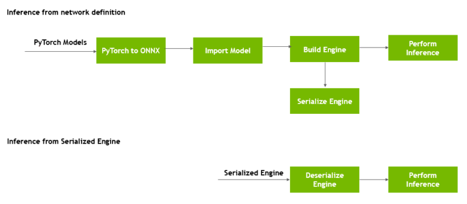

# tensorrt使用总结

## pytorch转tensorrt



方式1：加载onnx模型文件，使用tensorrt的build在程序运行的时候根据当前平台构建tensorrt的Engine；**好处**是所有nvidia的平台均适用；**坏处**是每次构建模型的时候很耗时

方式2：使用trtexec工具将onnx预先构建为tensorrt的Engine，并通过二进制方式保存，加载的时候直接加载tensorrt的Engine；**好处**是每次加载很快；**坏处**是在什么平台上(如V100)上构建的模型，只能在该平台上使用。

## trtexec工具

```shell
# 动态维度，在转onnx的时候需要将对应维度通过dynamic_axes设置为动态维度
trtexec --explicitBatch --onnx=pse_sim.onnx \
  --fp16  \
  --minShapes=input:1x3x100x100 \
  --optShapes=input:1x3x896x1312 \
  --maxShapes=input:1x3x2000x3000 \
  --shapes=input:1x3x1000x1000 \
  --saveEngine=pse_sim.engine
```


## 多线程

多线程示例：

TensorRT_sample.zip

```txt
1. Please prepare TensorRT engine of GPU and DLA with trtexec first. For example, 
$ /usr/src/tensorrt/bin/trtexec --onnx=/usr/src/tensorrt/data/mnist/mnist.onnx --saveEngine=gpu.engine 
$ /usr/src/tensorrt/bin/trtexec --onnx=/usr/src/tensorrt/data/mnist/mnist.onnx --useDLACore=0 --allowGPUFallback --saveEngine=dla.engine 
2. Compile TensorRT_sample.zip (3.5 KB) 
$ unzip TensorRT_sample.zip 
$ cd TensorRT_sample 
$ nvcc -std=c++11 main.cpp -I/root/TensorRT-7.2.2.3/include/  -L/root/TensorRT-7.2.2.3/lib -lnvinfer -o test
3. Test Please…
```


参考：

https://developer.nvidia.com/blog/speeding-up-deep-learning-inference-using-tensorrt/

https://forums.developer.nvidia.com/t/how-to-use-tensorrt-by-the-multi-threading-package-of-python/123085