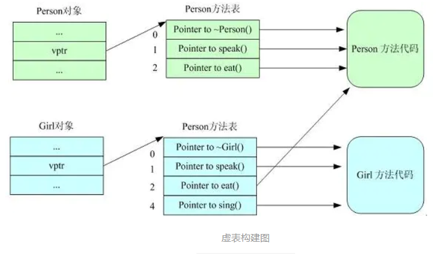

### 1. 子类析构时要调用父类的析构函数吗

定义一个对象时先调用基类的构造函数、然后调用派生类的构造函数；

析构的时候恰好相反：先调用派生类的析构函数、然后调用基类的析构函数。

### 2. 多态，虚函数，纯虚函数，抽象类

**多态**：是对于不同对象接收相同消息时产生不同的动作。

C++的多态性具体体现在运行和编译两个方面：在程序运行时的多态性通过继承和虚函数来体现；在程序编译时多态性体现在函数和运算符的重载上；

**虚函数**：在基类中冠以关键字 virtual 的成员函数。子类可以（也可以不）重新定义基类的虚函数，该行为称之为复写Override。

子类如果不提供虚函数的实现，将会自动调用基类的缺省虚函数实现，作为备选方案；

虚函数实现的过程是：**通过对象内存中的虚函数指针vptr找到虚函数表vtbl，再通过vtbl中的函数指针找到对应虚函数的实现区域并进行调用。**所以虚函数的调用时由指针所指向内存块的具体类型决定的。

当基类中的某个成员方法，在大多数情形下都应该由子类提供个性化实现，但基类也可以提供缺省备选方案的时候，该方法应该设计为虚函数。

**纯虚函数**：在虚函数后加“=0”，如 virtual void func()=0；如果一个类中至少有一个纯虚函数，那么这个类被称为**抽象类**（abstract class）

从基类继承来的纯虚函数，在子类中仍是虚函数。子类如果不实现纯虚函数，而只是继承基类的纯虚函数，则子类也是抽象类

子类如果实现了所有的纯虚函数，则子类非抽象类，可以用来创建对象；实现了纯虚函数的子类，该纯虚函数在子类中就变成了虚函数。

作用：在基类中为其派生类保留一个函数的名字，以便派生类根据需要对它进行定义。作为接口而存在 纯虚函数不具备函数的功能，一般不能直接被调用。

当基类中的某个成员方法，必须由子类提供个性化实现的时候，应该设计为纯虚函数。

**抽象类**：带有纯虚函数的类为抽象类，抽象类的主要作用是将有关的操作作为结果接口组织在一个继承层次结构中，由它来为派生类提供一个公共的根，派生类将具体实现在其基类中作为**接口**的操作。用户不能创建类的实例。但仍可使用指向抽象类的指针支持运行时多态性。

抽象类中不仅包括纯虚函数，也可包括虚函数

### 3. 构造函数和析构函数可以是虚函数吗？

构造函数不能是虚函数，析构函数可以是虚函数且推荐最好设置为虚函数。

首先，我们已经知道虚函数的实现则是通过对象内存中的vptr来实现的。而构造函数是用来实例化一个对象的，通俗来讲就是为对象内存中的值做初始化操作。那么在构造函数完成之前，也即还没有进行初始化，此时vptr是没有值的，也就无法通过vptr找到作为构造函数和虚函数所在的代码区，所以构造函数只能以普通函数的形式存放在类所指定的代码区中。

而对于析构函数，当我们delete(a)的时候，如果析构函数不是虚函数，那么调用的将会是基类base的析构函数。而当继承的时候，通常派生类会在基类的基础上定义自己的成员，此时我们当然希望可以调用派生类的析构函数对新定义的成员也进行析构。

### 4. 多态的实现

存在虚函数的类至少有一个(多继承会有多个)一维的虚函数表叫做虚表(virtual table)，属于类成员，虚表的元素值是虚函数的入口地址，在编译时就已经为其在数据端分配了空间。编译器另外还为每个类的对象提供一个虚表指针(vptr)，指向虚表入口地址，属于对象成员。在实例化派生类对象时，先实例化基类，将基类的虚表入口地址赋值给基类的虚表指针，当基类构造函数执行完时，再将派生类的虚表入口地址赋值给基类的虚表指针（派生类和基类此时共享一个虚表指针，并没有各自都生成一个），在执行父类的构造函数。
 以上是C++多态的实现过程，可以得出结论：

1. 有虚函数的类必存在一个虚表。
2. 虚表的构建：基类的虚表构建，先填上虚析构函数的入口地址，之后所有虚函数的入口地址按在类中声明顺序填入虚表；派生类的虚表构建，先将基类的虚表内容复制到派生类虚表中，如果派生类覆盖了基类的虚函数，则虚表中对应的虚函数入口地址也会被覆盖，为了后面寻址的一致性。

```cpp
class Person{ 
     . . . 
 public : 
    Person (){} 
    virtual ~Person (){}; 
    virtual void speak (){}; 
    virtual void eat (){}; 
 }; 
 
class Girl : public Person{ 
     . . . 
   public : 
   Girl(){} 
   virtual ~Girl(){}; 
   virtual void speak(){}; 
   virtual void sing(){}; 
```



虚函数表中有序放置了父类和子类中的所有虚函数，并且相同虚函数在类继承链中的每一个虚函数表中的偏移量都是一致的。所以确定的虚函数对应virtual table中一个固定位置n，n是一个在编译时期就确定的常量，所以，使用vptr加上对应的n，就可以得到对应的函数入口地址。C++采用的这种绝对地址+偏移量的方法调用虚函数，查找速度快执行效率高，时间复杂度为O(1)
 这里概括一下虚函数的寻址过程：

1. 获取类型名和函数名
2. 从符号表中获得当前虚函数的偏移量
3. 利用偏移量得到虚函数的访问地址，并调用虚函数。

### 3. 重载（overload)和重写(overried）的区别

**重载**：是指允许存在多个同名函数，而这些函数的参数表不同（或许参数个数不同，或许参数类型不同，或许两者都不同）。

**重写**：是指子类重新定义父类虚函数的方法。和多态真正相关。当子类重新定义了父类的虚函数后，父类指针根据赋给它的不同的子类指针，动态的调用属于子类的该函数，这样的函数调用在编译期间是无法确定的（调用的子类的虚函数的地址无法给出）。因此，这样的函数地址是在运行期绑定的（晚绑定）

### 4. C++是不是类型安全的

不是。两个不同类型的指针之间可以强制转换（用reinterpret cast)

### 5. main 函数执行以前，还会执行什么代码

全局对象的构造函数会在main 函数之前执行

### 6. 描述内存分配方式以及它们的区别

C++程序内存由栈区、堆区、数据区（静态存储区）和程序代码区组成

1. 从静态存储区域分配。内存在程序**编译的时候**就已经分配好，这块内存在程序的整个运行期间都存在。例如全局变量，static 变量。

   初始化的全局变量和静态变量在一块区域(.data)，未初始化的全局变量和未初始化的静态变量在相邻的另一块区域(.bss)

2. 在栈上创建。在执行函数时，函数内局部变量的存储单元都可以在栈上创建，函数执行结束时这些存储单元自动被释放。栈内存分配运算内置于处理器的指令集。

3. 从堆上分配，亦称动态内存分配。程序在运行的时候用malloc 或new 申请内存，程序员自己负责在何时用free 或delete 释放内存。动态内存的生存期由程序员决定，使用非常灵活，但问题也最多。

4. 代码区：存放CPU执行的机器指令，代码区是可共享，并且是只读的

5. 常量区：存放常量的区间，如字符串常量等，注意在常量区存放的数据一旦经初始化后就不能被修改。 程序结束后由系统释放

```cpp
int a = 0;          // 全局初始化区 
char *p1;         // 全局未初始化区
char s1[] = "abcdef"; //1） s1在静态区，"abcdef"无需额外存放，就是数组s1内部，总共占用一个串的内存
const char *p ="abcdef";//2）p在静态区,"abcdef",必须额外存放（在常量区，通常也在静态区），/总共占用一个指针，和一个串的内存

void main() 
{ 
  int b;            // 栈区
  char s[]="abcdef";//s是在栈区，“abcdef”在常量区，运行的时候复制给s，
  *s='w';//正确
  s[2]='w';//正确
  const char *p3 = "123456"; // p3在栈区，"123456"在常量区,其值不能被修改，指向常量的指针是不可以通过指针移动去修改指针所指内容的
  *p3='w';//错误,此区域是编译的时候确定的，并且程序结束的时候自动释放的， *p3= 'w';企图修改文字常量区引起错误
  char *p2;         // 栈区
  static int c =0;         // 全局（静态）初始化区 
  p1 = (char *)malloc(10); 
  p2 = (char *)malloc(20); // 分配得来的10和20字节的区域就在堆区 
  strcpy(p1, "123456");    // "123456" 放在常量区，编译器可能会将它与p3所指向的"123456"优化成一个地方 
} 
```

### 7. static全局变量与普通的全局变量有什么区别？

全局变量(外部变量)的说明之前再冠以static 就构成了静态的全局变量。全局变量本身就是静态存储方式， 静态全局变量当然也是静态存储方式。 这两者在存储方式上并无不同。这两者的区别在于作用域的扩展上。**非静态的全局变量可以用extern扩展到组成源程序的多个文件中，而静态的全局变量的作用域只限于本文件，不能扩展到其它文件**，由于静态全局变量的作用域局限于一个源文件内，只能为该源文件内的函数公用，因此可以避免在其它源文件中引起错误。把全局变量改变为静态全局变量后是改变了它的作用域，限制了它的使用范围。

### 8. static关键字

1. 函数体内 static 变量的作用范围为该函数体，不同于 auto 变量， 该变量的内存只被分配一次，因此其值在下次调用时仍维持上次的值
2. 在模块内的 static 全局变量可以被模块内所有函数访问，但不能被模块外其他函数访问
3. 在类的static 成员变量属于整个类所拥有，对类的所以对象只有一份拷贝
4. static函数与普通函数作用域不同,仅在本文件。在模块内的static 函数只可被这一模块内的其他函数调用，这个函数的使用范围被限制在声明它的模块内
5. static函数与普通函数最主要区别是static函数在内存中只有一份，普通函数在每个被调用中维持一份拷贝。静态成员函数与普通成员函数的根本区别在于：普通成员函数有 this 指针，可以访问类中的任意成员；而静态成员函数没有 this 指针，只能访问静态成员（包括静态成员变量和静态成员函数）。

### 9. new 与malloc有什么区别

1.  **属性**：new和delete是C++关键字，需要编译器支持；malloc和free是库函数，需要头文件支持。

2.  **参数**：使用new操作符申请内存分配时无须指定内存块的大小，编译器会根据类型信息自行计算。而malloc则需要显式地指出所需内存的尺寸。

3. **返回类型**：new操作符内存分配成功时，返回的是对象类型的指针，类型严格与对象匹配，无须进行类型转换，故new是符合类型安全性的操作符。而malloc内存分配成功则是返回void * ，需要通过强制类型转换将void*指针转换成我们需要的类型

4. new/delete 主要是用在类对象的申请和释放。申请的时候会调用构造器完成初始化，释放的时候，会调用析构器完成内存清理。

5. **内存区域**：new和malloc申请的内存都在堆中，只有静态建立，如A a的对象在栈中

6. **分配失败**：new内存分配失败时，会抛出bac_alloc异常。malloc分配内存失败时返回NULL

7. **对数组的处理**：new对数组的支持体现在它会分别调用构造函数函数初始化每一个数组元素，释放对象时为每个对象调用析构函数。注意delete[]要与new[]配套使用，不然会造成数组对象部分释放的现象，造成内存泄漏。malloc，所以如果要动态分配一个数组的内存，还需要我们手动自定数组的大小。

   int* arr = new int[n];//创建一维数组      delete[] arr;//销毁

8. **是否可以被重载**：opeartor new /operator delete可以被重载。malloc/free并不允许重载

9. **new与malloc是否可以相互调用**：operator new /operator delete的实现可以基于malloc，而malloc的实现不可以去调用new。

### 10. 请说出const与#define 相比，有何优点

const作用：定义常量、修饰函数参数、修饰函数返回值三个作用。被Const修饰的东西都受到强制保护，可以预防意外的变动，能提高程序的健壮性。

修饰函数返回值时可以阻止用户修改返回值。返回值也要相应的付给一个常量或常指针

1. #define是在编译的预处理阶段起作用，而const是在 编译、运行的时候起作用

2.  #define只是简单的字符串替换，没有类型检查。而const有对应的数据类型，是要进行判断的，可以避免一些低级的错误。
3. \#define只是进行展开，有多少地方使用，就替换多少次，它定义的宏常量在内存中有若干个备份；const定义的只读变量在程序运行过程中只有一份备份
4. const常量可以进行调试的，define是不能进行调试的，因为在预编译阶段就已经替换掉了

### 11. 简述数组与指针的区别

1. 数组要么在静态存储区被创建（如全局数组），要么在栈上被创建。指针可以随时指向任意类型的内存块。

2. 同类型指针变量可以相互赋值，数组不行，只能一个一个元素的赋值或拷贝
3. 数组可以用sizeof求出数组占用内存大小，指针不行

### 12. 引用与指针有什么区别

**指针和引用都是地址的概念，指针指向一块内存，它的内容是所指内存的地址；引用是某块内存的别名。**

1. 引用必须被初始化，指针不必。
2. 引用初始化以后不能被改变，指针可以改变所指的对象。
3. 不存在指向空值的引用，但是存在指向空值的指针。

4. 对引用使用“sizeof”得到的是变量的大小，对指针使用“sizeof”得到的是变量的地址的大小。
5. 理论上指针的级数没有限制，但引用只有一级。即不存在引用的引用，但可以有指针的指针。
6. 就++操作而言，对引用的操作直接反应到所指向的对象，而不是改变指向；而对指针的操作，会使指针指向下一个对象，而不是改变所指对象的内容

### 13. 全局变量和局部变量有什么区别？是怎么实现的？操作系统和编译器是怎么知道的？

全局变量随主程序创建而创建，随主程序销毁而销毁；局部变量在局部函数内部，甚至局部循环体等内部存在，退出就不存在；

使用方式不同：通过声明后全局变量程序的各个部分都可以用到；局部变量只能在局部使用；分配在栈区。 

操作系统和编译器通过内存分配的位置来知道的，全局变量分配在全局数据段并且在程序开始运行的时候被加载。局部变量则分配在堆栈里面 

### 14. extern

1. extern “C”告诉编译器在编译fun这个函数名时按着C的规则去翻译相应的函数名而不是C++的。C++语言在编译的时候为了解决函数的多态问题，会将函数名和参数联合起来生成一个中间的函数名称，而C语言则不会，因此会造成链接时找不到对应函数的情况，此时C函数就需要用extern “C”进行链接指定，这告诉编译器，请保持我的名称，不要给我生成用于链接的中间函数名。

2. 修饰变量或函数时，它的作用就是声明函数或全局变量的作用范围的关键字，其声明的函数和变量可以在本模块或其他模块中使用；记住它是一个**声明不是定义**

   也就是说B模块要是引用模块A中**定义**的全局变量或函数时，它只要包含A模块的头文件（头文件中用extern申明）即可,在编译阶段，模块B虽然找不到该函数或变量，但它不会报错，它会在连接时从模块A生成的目标代码中找到此函数。

   **一般只在文件中做声明**

   ```cpp
   //test1.h
   #ifndef TEST1H
   #define TEST1H
   extern char g_str[]; // 声明全局变量g_str
   void fun1();
   #endif
   //test1.cpp
   #include "test1.h"
   char g_str[] = "123456"; // 定义全局变量g_str
   void fun1() { cout << g_str << endl; }
   //test2.cpp
   #include "test1.h"
   void fun2()    { cout << g_str << endl;    }
   ```

   

### 15. extern 和 static

extern 表明该变量在别的地方已经定义过了,在这里要使用那个变量.

static 表示静态的变量，分配内存的时候, 存储在静态区,不存储在栈上面.

extern和static不能同时修饰一个变量

static修饰的全局变量声明与定义同时进行，也就是说当你在头文件中使用static声明了全局变量后，它也同时被定义了；

static修饰全局变量的作用域只能是本身的编译单元，也就是说它的“全局”只对本编译单元有效，其他编译单元则看不到它

**一般定义static全局变量时，都把它放在原文件中而不是头文件**，这样就不会给其他模块造成不必要的信息污染

### 16. extern 和const

const单独使用时它就与static相同，而当与extern一起合作的时候，它的特性就跟extern的一样了

const修饰的全局常量据有跟static相同的特性，即它们只能作用于本编译模块中

但是const可以与extern连用来声明该常量可以作用于其他编译模块中, 如extern const char g_str[];

### 11 指针

```cpp
char *const cp; //指向常量的指针
char const *pc1; //常指针
const char *pc1;  //常指针
const int*const pc;  //指向常量的常指针
int (*p)[4];  //数组指针，指向一个大小为4个整型的数组的数组指针
    //数组名是地址，与数组首元素地址仅代表自己类型那么大内存不同，数组名内存指向能力非常强。
    //数组名指向整个数组空间。进一步讲，对数组名取地址，即就是在对整个数组取地址，则数组的地址自然要用指向数组的指针才能接收，
    //所以，必须定义指向数组的指针类型，即为数组指针。
	int ar[10] = { 1,2,3,4,5,6,7,8,9,10 };
	int **p = &ar;  //报错
	int(*pp)[10] = &ar; //正确
int *p[10];   //指针数组
int(*pfun)(int, int);  //函数指针，一般指针都有加1的能力，但是，函数指针不允许做这样的运算。即pfun+1是一个非法的操作
int* fun(int a, int b){} //指针函数，返回指针类型的函数称为指针函数，只要返回值为指针，无论是什么类型的指针，都称为指针函数
//返回函数指针的指针函数
int(*func(int a, int b, int(*FUN)(int, int))) (int, int){}
```


### 17. register存储类型

register：这个关键字请求编译器尽可能的将变量存在CPU内部**`寄存器`**中，而不是通过内存寻址访问，因此访问register变量将在很大程度上提高效率，因为省去了变量由内存调入到寄存器过程中的好几个指令周期。**注意是尽可能，不是绝对**

register修饰符的注意点：

1. register变量必须是能被CPU所接受的类型。这通常意味着register变量必须是一个单个的值，并且长度应该小于或者等于整型的长度。不过，有些机器的寄存器也能存放浮点数。 
2. 因为register变量可能不存放在内存中，所以不能用“&”来获取register变量的地址。 
3. 由于寄存器的数量有限，而且某些寄存器只能接受特定类型的数据（如指针和浮点数），因此真正起作用的register修饰符的数目和类型都依赖于运行程序的机器，而任何多余的register修饰符都将被编译程序所忽略。 
4. 在某些情况下，把变量保存在寄存器中反而会降低程序的运行速度。因为被占用的寄存器不能再用于其它目的；或者变量被使用的次数不够多，不足以装入和存储变量所带来的额外开销。 
5. 随着编译程序设计技术的进步，在决定那些变量应该被存到寄存器中时，现在的C编译环境能比程序员做出更好的决定。实际上，许多编译程序都会忽略register修饰符，因为尽管它完全合法，**`但它仅仅是暗示而不是命令`**。

### 11 explicit

C++中， 一个参数的构造函数(或者除了第一个参数外其余参数都有默认值的多参构造函数)， 承担了两个角色。 

1 是个构造；2 是个默认且隐含的类型转换操作符。

```cpp

#include <iostream>
using namespace std;
class Test1
{
  public :
	Test1(int num):n(num){}
  private:
	int n;
};
class Test2
{
  public :
	explicit Test2(int num):n(num){}
  private:
	int n;
}; 
int main()
{
	Test1 t1 = 12;  //调用构造函数
	Test2 t2(13);
	Test2 t3 = 14;	//报错
	return 0;
}
```

explicit的作用是用来声明类构造函数是显示调用的，而非隐式调用，所以只用于修饰单参构造函数。因为无参构造函数和多参构造函数本身就是显示调用的。

当类的声明和定义分别在两个文件中时，explicit只能写在在声明中，不能写在定义中。

## volatile

### 11 常见的STL容器有哪些？算法用过哪几个？

### 11 线程和进程的联系和区别

每个进程都有自己独立的一块内存空间，一个进程可以有多个线程。

多个线程共享进程的**堆**和**方法区**资源，但每个线程有自己的**程序计数器**、**虚拟机栈**和**本地方法栈**，所以系统在产生一个线程，或是在各个线程之间作切换工作时，负担要比进程小得多，也正因为如此，线程也被称为轻量级进程

通常一个进程都有若干个线程，至少包含一个线程。在引入线程的操作系统中，通常都是把进程作为分配资源的基本单位，而把线程作为独立运行和独立调度的基本单位，由于线程比进程更小，基本上不拥有系统资源，故对它的调度所付出的开销就会小得多，能更高效的提高系统多个程序间并发执行的程度。

**根本区别**：进程是操作系统资源分配的基本单位，而线程是处理器任务调度和执行的基本单位

**资源开销**：每个进程都有独立的代码和数据空间（程序上下文），程序之间的切换会有较大的开销；线程可以看做轻量级的进程，同一类线程共享代码和数据空间，每个线程都有自己独立的运行栈和程序计数器（PC），线程之间切换的开销小。

**包含关系**：如果一个进程内有多个线程，则执行过程不是一条线的，而是多条线（线程）共同完成的；线程是进程的一部分，所以线程也被称为轻权进程或者轻量级进程

**内存分配**：同一进程的线程共享本进程的地址空间和资源，而进程之间的地址空间和资源是相互独立的

**影响关系**：一个进程崩溃后，在保护模式下不会对其他进程产生影响，但是一个线程崩溃整个进程都死掉。所以多进程要比多线程健壮。

**执行过程**：每个独立的进程有程序运行的入口、顺序执行序列和程序出口。但是线程不能独立执行，必须依存在应用程序中，由应用程序提供多个线程执行控制，两者均可并发执行

### 11 进程间的通信方式

管道、有名管道、信号、共享内存、消息队列、信号量、套接字、文件.

### 11 线程同步和线程互斥的区别

### 11 静态链表和动态链表的区别

### 11 大并发( epoll )

### 11 孤儿进程和僵尸进程

### 11 同步IO和异步IO的区别？

### 18 什么是内存泄漏？什么是野指针？什么是内存越界？如何避免？

**内存泄漏**：用动态内存分配函数动态开辟的空间，在使用完毕后未释放，程序结束后，会导致一直占据该内存单元，直到程序结束

**野指针**：指向“垃圾”内存的指针。即指针指向的内容是不确定的。

产生的原因：
 1）指针变量没有初始化。因此，创建指针变量时，该变量要被置为NULL或者指向合法的内存单元。
 2）指针p被free之后，没有置为NULL，让人误以为p是个合法的指针。
 3）指针跨越合法范围操作。不要返回指向栈内存(非静态局部变量）的指针或引用。
 可能后果：

- 若操作系统将这部分已经释放的内存重新分配给另外一个进程，而原来的程序重新引用现在的迷途指针，向其中写入数据，则这部分程序内容将被破坏，而导致程序错误。这种类型的程序错误，通常会导致segment fault和一般的保护错误。
- 其他常见错误：返回一个基于栈分配的局部变量的地址时，一旦调用的函数返回，分配给这些变量的空间将回收，此时它们拥有的是垃圾值，如return &num，如果要使它的生命周期边长，应该将其声明为static

**内存越界**：存在一种情况就是调用栈溢出(stackoverflow)，还有一种情况是缓冲区溢出，这两种情况都会导致安全漏洞。

1. 缓冲区溢出：strcpy会一直复制直到碰到\0，很多平台的栈变量是按照地址顺序倒着分配的（高地址向低地址），所以destination溢出后会先修改先前定义的变量，这样黑客就可以把is_administrator改为true，从而造成缓冲区溢出攻击,当然数组越界也可以造成类似的效果，不过现在C++都提供了越界检查的版本

2.  栈溢出攻击：在栈上分配length字节的空间，再往栈顶放上一个data。当Length十分大，会把data挤到栈空间之外，此时如果编译器不做越界检查的话，那么黑客只要用客户端送特定的length和data，就能改写服务器的任意内存(比如黑客可以修改服务器代码的机器码，注入一些JMP指令跳转到黑客想执行的函数)

### 11 如何理解智能指针,什么时候改变引用计数

### 11 share_ptr 与weak_ptr 的区别与联系

### 11 C++构造函数是否可以抛出异常

构造函数可以抛出异常。但从逻辑上和风险控制上，构造函数中尽量不要抛出异常，既需要分配内存，又需要抛出异常时要特别注意防止内存泄露的情况发生。因为在构造函数中抛出异常，在概念上将被视为该对象没有被成功构造，因此当前对象的析构函数就不会被调用，就会造成内存泄漏。同时，由于构造函数本身也是一个函数，在函数体内抛出异常将导致当前函数运行结束，并释放已经构造的成员对象，包括其基类的成员，即执行直接基类和成员对象的析构函数

### 11 是否在析构函数抛出异常

1)如果析构函数抛出异常，则异常点之后的程序不会执行，如果析构函数在异常点之后执行了某些必要的动作比如释放某些资源，则这些动作不会执行，会造成诸如资源泄漏的问题。
 2）通常异常发生时，c++的机制会调用已经构造对象的析构函数来释放资源，此时若析构函数本身也抛出异常，则前一个异常尚未处理，又有新的异常，会造成程序崩溃的问题。

3那么当无法保证在析构函数中不发生异常时， 其实还是有很好办法来解决的。那就是把异常完全封装在析构函数内部，决不让异常抛出函数之外。这是一种非常简单，也非常有效的方法。

### 11 volatile 的作用

### 11 构造函数和析构函数可以调用虚函数吗

虽然可以对虚函数进行实调用，但程序员编写虚函数的本意应该是实现动态联编。在构造函数中调用虚函数，函数的入口地址是在编译时静态确定的，并未实现虚调用。但是为什么在构造函数中调用虚函数，实际上没有发生动态联编呢？
 第一个原因，在概念上，构造函数的工作是为对象进行初始化。在构造函数完成之前，被构造的对象被认为“未完全生成”。当创建某个派生类的对象时，如果在它的基类的构造函数中调用虚函数，那么此时派生类的构造函数并未执行，所调用的函数可能操作还没有被初始化的成员，将导致灾难的发生。
 第二个原因，即使想在构造函数中实现动态联编，在实现上也会遇到困难。这涉及到对象虚指针（vptr）的建立问题。在Visual C++中，包含虚函数的类对象的虚指针被安排在对象的起始地址处，并且虚函数表（vtable）的地址是由构造函数写入虚指针的。所以，一个类的构造函数在执行时，并不能保证该函数所能访问到的虚指针就是当前被构造对象最后所拥有的虚指针，因为后面派生类的构造函数会对当前被构造对象的虚指针进行重写，因此无法完成动态联编

### 11 内联函数有什么优点？内联函数和宏定义的区别。

1.内联函数在运行时可调试，而宏定义不可以;
 2.编译器会对内联函数的参数类型做安全检查或自动类型转换（同普通函数），而宏定义则不会；
 3.内联函数可以访问类的成员变量，宏定义则不能；
 4.在类中声明同时定义的成员函数，自动转化为内联函数
 内联函数和普通函数相比可以加快程序运行的速度，因为不需要中断调用，在编译的时候内联函数可以直接被镶嵌到目标代码中。
 内联函数要做参数类型检查，这是内联函数跟宏相比的优势。

### 11 数组与指针的区别与联系，函数指针，指针函数，指针数组，数组指针

### 11 锁


